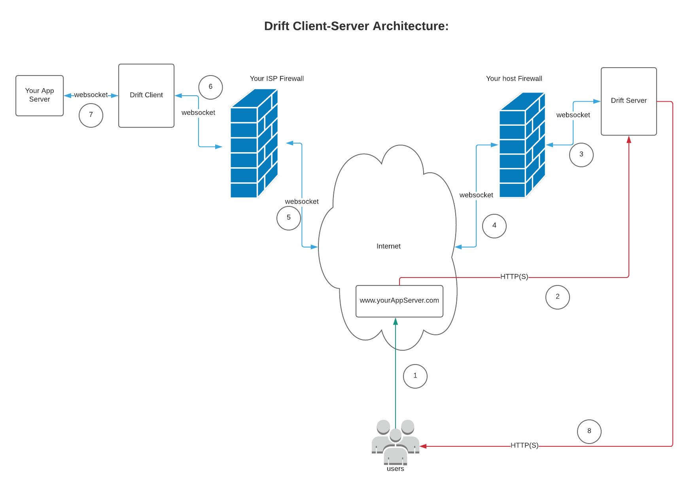

# drift


A Websocket-Http Tunnel written in kotlin that lets you access any HTTP Api on servers deployed behind firewall(s)/Nat(s)/Proxy

###What is drift?
Drift lets you deploy any application anywhere and expose it on internet via a websocket-http tunnels. 
So how does it look like?




###How does it work ?
Preconditions:
Your client should have access to internet/drift server.
The drift client establishes a connection to the drift server over outbound http which is usually not blocked by firewalls.
The drift server then sends an upgrade, upgrading just established http connection to a websocket connection.
Now your drift server is ready to accept incoming traffic and forward it to you app server deployed via the websocket connection.
 
 
###Getting Started
The drift app can be run int following three modes:
 - SERVER
 - CLIENT
 - SERVER AND CLIENT
 
The applciation is published at docker as ```ankur4u007/drift```, so to run it as docker(easier) you must have docker installed.
If you prefer `gradle` way of running things please refer to [Build and Run locally](#gradle-build) section.
 
To run as server: 
    ```docker run -it --net=host -e "TUNNEL__SERVER__ENABLED=TRUE" ankur4u007/drift```

To run as client: 
    ```docker run -it --net=host -e "TUNNEL__CLIENT__ENABLED=TRUE" ankur4u007/drift```

To run as both the server and client: 
    ```docker run -it --net=host -e "TUNNEL__SERVER__ENABLED=TRUE" -e "TUNNEL__CLIENT__ENABLED=TRUE" ankur4u007/drift```

### <a name="gradle-build"></a> Build and Run locally 
The app is developed using spring reactive and can be easily build and run with `gradlew`
 - To build: ```./gradlew clean build```
 - To run locally: ```./gradlew clean run```
 
Additionally you can also build docker images after you have built with gradle. To do so simple run: 
```docker build --force-rm -t ankur4u007/drift .```
